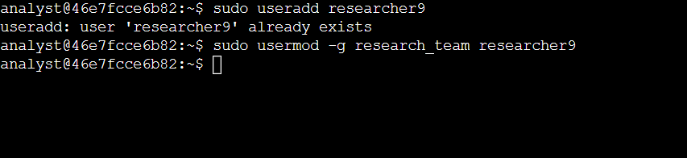
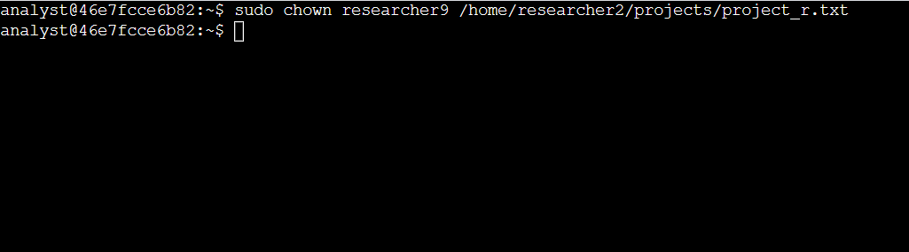
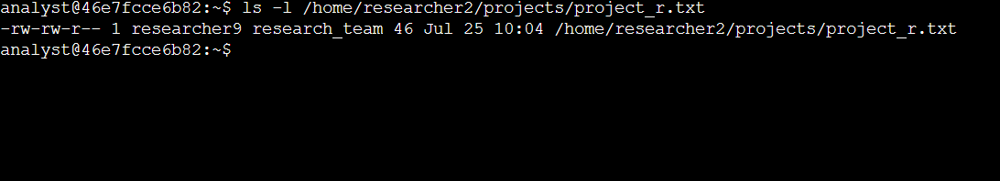
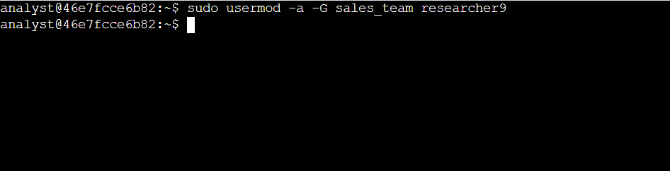
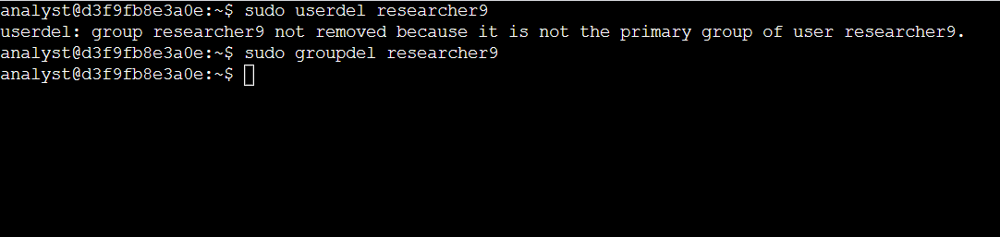

# Managing Users On Linux

Previously I made a <a href="https://github.com/ycast-tech/Managing-Linux-File-Permissions">project</a> focused on authorization, the concept of granting access to specific resources in a system. Another important concept in security is authentication. Authentication is the process of a user proving that they are who they say they are in the system.

When managing this, security analysts need to ensure: 
- not all users get access to the system,
- new users (those who are new to the organization or a group) are added to the system, and
- current users who change groups or leave the organization are deleted from the system. 
In this project, I’ll use the focus in this topics by adding, managing, and deleting users from an organization.

In Linux Bash shell, the commands <code>useradd</code>, <code>usermod</code>, <code>userdel</code>, and <code>chown</code> can be used to manage user access.

In this scenario, a new employee with the username <code>researcher9</code> joins an organization. I have to add them to the system and continue to manage their access during their time with the organization.

## Add a new user

A new employee has joined the Research department. In this task, I must add them to the system. The username assigned to them is <code>researcher9</code>.

To add a user to the system I must use <code>useradd</code> command.

Next, I need to add the new user to the <code>research_team</code> group. 
I need to use the <code>usermod</code> command and <code>-g</code> option to add <code>researcher9</code> to the <code>research_team</code> group as their primary group.

<b>Note:</b> The commands used need elevated permissions, for that, the <code>sudo</code> command is used.

<b>Step 1:</b> run <code>sudo useradd researcher9</code> 
<b>Step 2:</b> run <code>sudo usermod -g research_team researcher9</code>

## Assign file ownership

The new employee, researcher9, will take responsibility for <code>project_r</code>. The project_r.txt file is located in the <code>/home/researcher2/projects</code> directory, and owned by the researcher2 user. I need to make researcher9 the owner of /home/researcher2/projects/project_r.txt

To change ownership, I need to run <code>chown</code> command followed by the new owner and the location of the file. 
<code>sudo chown researcher9 /home/researcher2/projects/project_r.txt</code>

To check if it was done correctly run <code>ls -l</code> to display information about the file such as ownership

## Add the user to a secondary group

In this task, I must add <code>researcher9</code> to a secondary group (<code>sales_team</code>). 
Researcher9 will also be part of the <code>sales_team</code> group but the primary group is still <code>research_team</code>. 
<code>sudo usermod -a -G sales_team researcher9</code>

Note: Options for Linux commands are case-sensitive, so I need to make sure to use a lowercase -a and an uppercase -G.

## Delete a user

A year later <code>researcher9</code> decides to leave the organization. 
In this task, you must remove them from the system.

To remove a user <cpde>userdel</code> command is used. 
Running <code>sudo userdel researcher9</code> will produce the following output: 
Userdel: Group researcher9 not removed because it is not the primary group of user researcher9. 

When you create a new user in Linux, a group with the same name as the user is automatically created and the user is the only member of that group. After removing users, it is good practice to clean up any empty groups that may remain behind.

The following command will help to delete the researcher9 group that is no longer required: <code>sudo groupdel researcher9</code>

## Summary

In this project I show my practical experience in using basic Linux Bash shell commands to:
- add a new user,
- add a user to a group,
- change user permissions on files, and
- delete a user.

This is an important milestone on my journey toward managing users in Linux!

##
